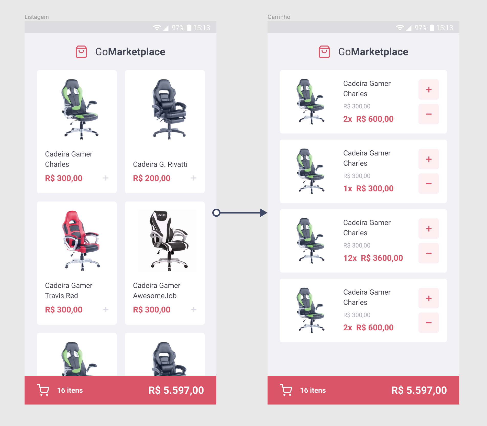

<h3 align="center">
  Challenge 08: React Native Fundamentals
</h3>

  

### 🚀 About the challenge

In this challenge, you will develop a new application, GoMarketplace. This time it's time for you to practice what you've learned so far in React Native along with TypeScript, using routes, Async Storage and the Context API.

### 📈 Tests Specification

- **`should be able to list the products`**: For this test to pass, your application must allow a transaction to be created, and return a json with the created transaction.

- **`should be able to list the products`**: For this test to pass, your application must allow all products that are returned from the Fake API to be listed on your Dashboard screen. This listing should display the title and price that must be formatted using the Intl function.

- **`should be able to add a product to the cart`**: In order for this test to pass, you must allow it to be possible to add products from your Dashboard to the cart, using the cart context provided.

- **`should be able to list the products on the cart`**: In order for this test to pass, you must allow it to be possible to list the products that are saved in the context of your cart on the Cart page, on that page display the product name and the total subtotal of each product (price * quantity).

- **`should be able to calculate the total cart`**: In order for this test to pass, both on the Dashboard page and on the Cart page, you must display the total value of all items in your cart.

- **`should be able to show the total quantity of items in the cart`**: For this test to pass, both on the Dashboard page and on the Cart page, you must display the total number of items that are in your cart.
Tip: To calculate the total of all items, you can use reduce to add up all the values ​​and return the total value.

- **`should be able to increment product quantity on the cart`**`**: In order for this test to pass, you must allow it to be possible to increase the quantity of a product in your cart, using the cart context provided.

- **`should be able to decrement product quantity on the cart`**: In order for this test to pass, you must allow it to be possible to decrease the quantity of a product in your cart, using the cart context provided.

- **`should be able to navigate to the cart`**: In order for this test to pass, in your FloatingCart component on the Dashboard, you must allow the user to be redirected when clicking on the cart button with the testID of navigate-to-cart-button Cart page.

- **`should be able to add products to the cart`**: In order for this test to pass, in your file containing the cart context, you must allow the addToCart function to add a new item to the cart.

- **`should be able to increment quantity`**: In order for this test to pass, in your file containing the cart context, you must allow the function to increment by 1 unit the quantity of an item that is stored in the context.

- **`should be able to decrement quantity`**: In order for this test to pass, in your file containing the cart context, you must allow the decrement function to decrease by 1 unit the quantity of an item that is stored in the context.

- **`should store products in AsyncStorage while adding, incrementing and decrementing`**: For this test to pass, in your file containing the cart context you must allow any updates you make to the cart to be saved in AsyncStorage. For example, when adding an item to the cart, add it to AsyncStorage as well. Remember to also update the AsyncStorage value when you increase or decrease the quantity of an item.

- **`should load products from AsyncStorage`**: In order for this test to pass, in your file containing the cart context, you must allow all products that have been added to be fetched from AsyncStorage.

### ✏️ Layout

<a href="https://www.figma.com/file/k448yiICuSJCPoEIWMowlI/GoMarketplace?node-id=0%3A1">Layout no Figma</a>

---

Made with ❤️ by morikawa77
